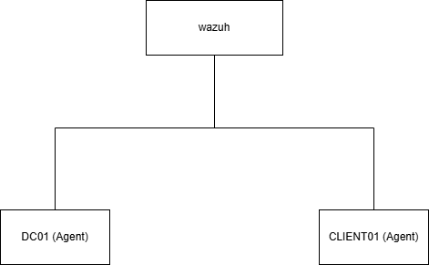
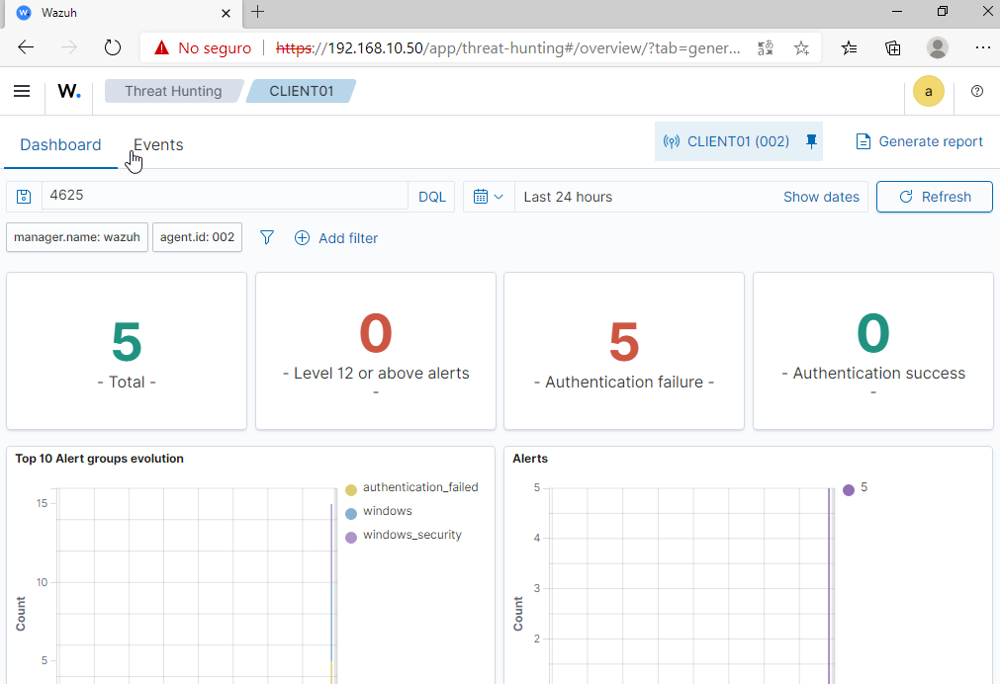
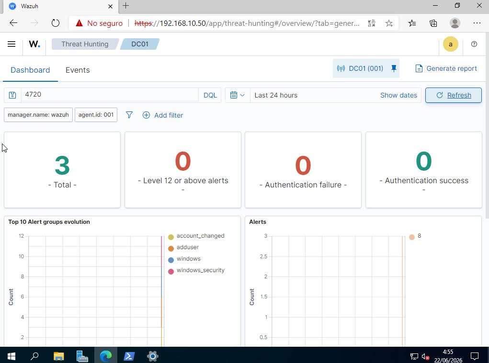
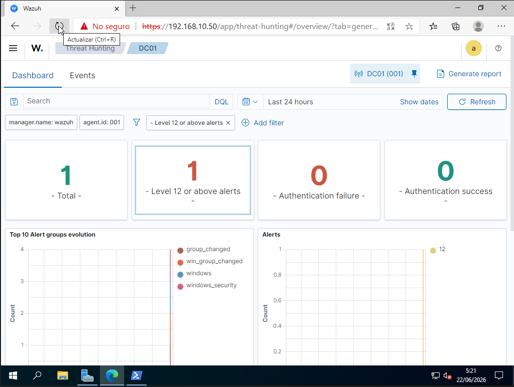

# Wazuh SOC Lab

SOC laboratory built to learn log collection, monitoring, alerting and Windows event analysis using Wazuh.

## Environment

### Infrastructure

- Ubuntu Server 24.04
- Wazuh 4.12
- Windows Server 2022
- Windows 11
- Active Directory
- DNS

### Hosts

| Host | Role |
|--------|--------|
| WAZUH | Wazuh Manager + Dashboard |
| DC01 | Domain Controller |
| CLIENT01 | Domain Joined Workstation |

## Objectives

- Deploy Wazuh
- Configure Windows agents
- Collect Windows logs
- Detect authentication events
- Monitor Active Directory changes

## Network

| Device | IP |
|----------|----------|
| WAZUH | 192.168.10.50 |
| DC01 | 192.168.10.10 |
| CLIENT01 | 192.168.10.20 |

## Architecture

## Screenshots

### Failed Logons

### User Creation

## Privilege Escalation

## Detections Implemented

### Failed Authentication Attempts

- Windows Event ID 4625
- Multiple failed logon attempts

### User Account Creation

- Windows Event ID 4720
- Detection of newly created accounts

### Privilege Escalation

- Windows Event ID 4728
- Detection of group changed

## Skills Demonstrated

- Wazuh Administration
- Windows Event Monitoring
- Active Directory Monitoring
- Log Analysis
- Security Operations
- Detection Engineering Fundamentals

## Future Improvements

- Sysmon integration
- PowerShell logging
- Privileged group monitoring
- Custom detection rules

## Author

Jonatan Arevalo
